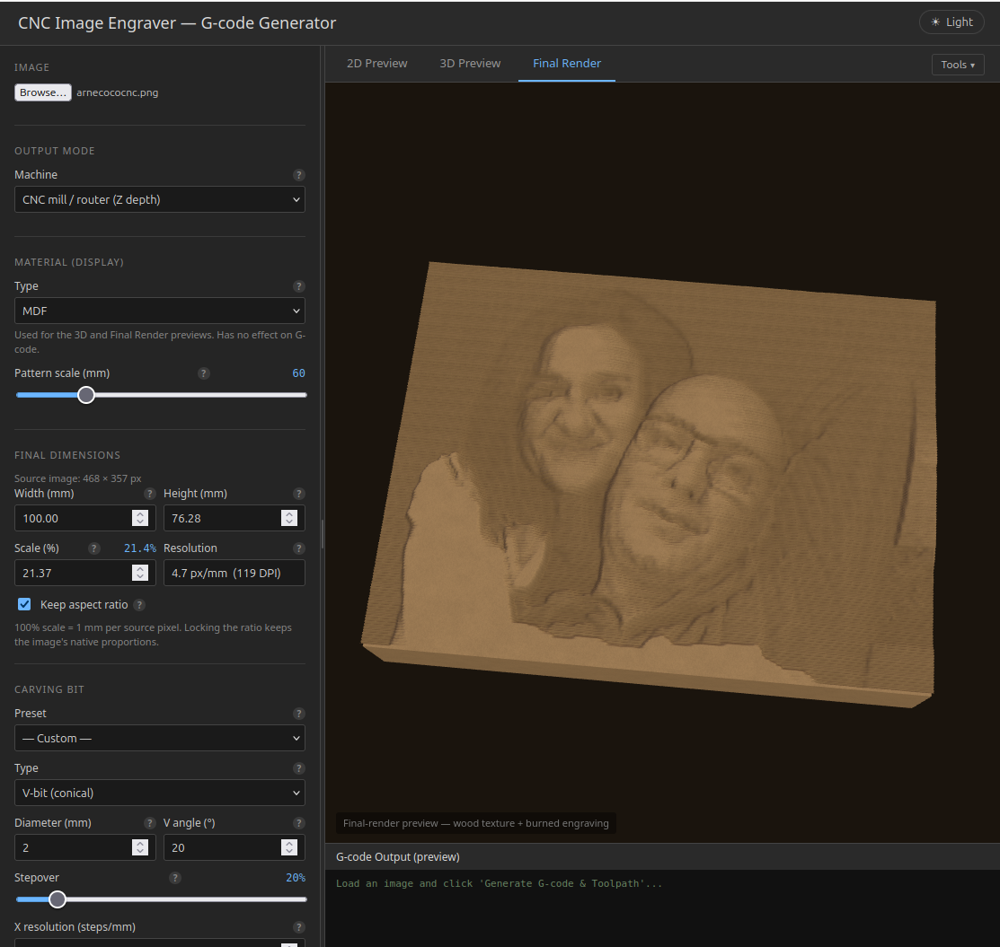

# image-cnc-laser
Convert an image to CNC G-code or laser G-code in your browser

 - Supports every image type your browser can read
 - Runs locally in your browser
 - Flip, rotate image
 - Set cutting depth, layers, toolbit etc. for CNC
 - Optionally draw square first with dimensions
 - Dither (for mono laser)
   - Floyd–Steinberg (error diffusion)
   - Atkinson (classic Mac)
   - Ordered (Bayer 4×4)
 - Adjust contrast and brightness
 - Enhance contrast
 - Live 3D preview
 - Selection of material choice
 - Generate CNC code

#### To use just download the files and open index.html in your browser, no server required.

